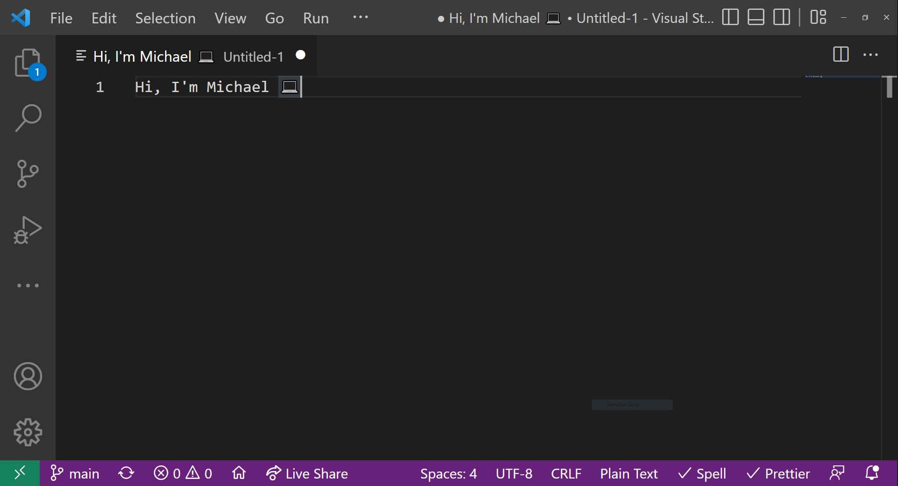
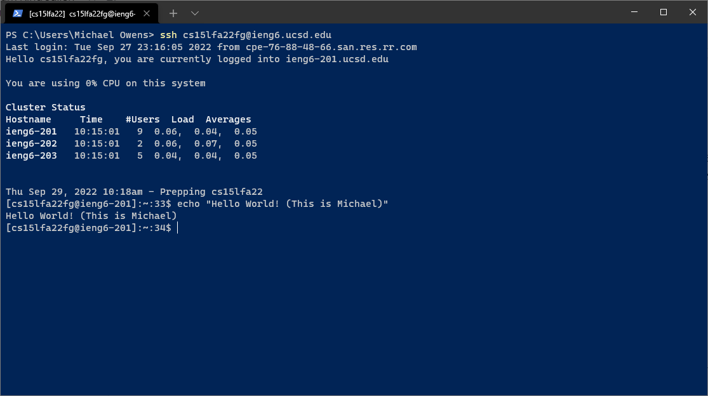
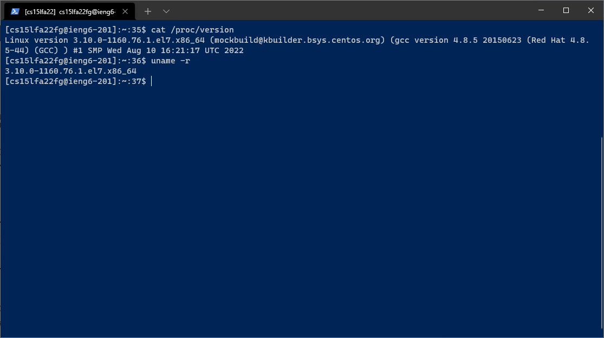
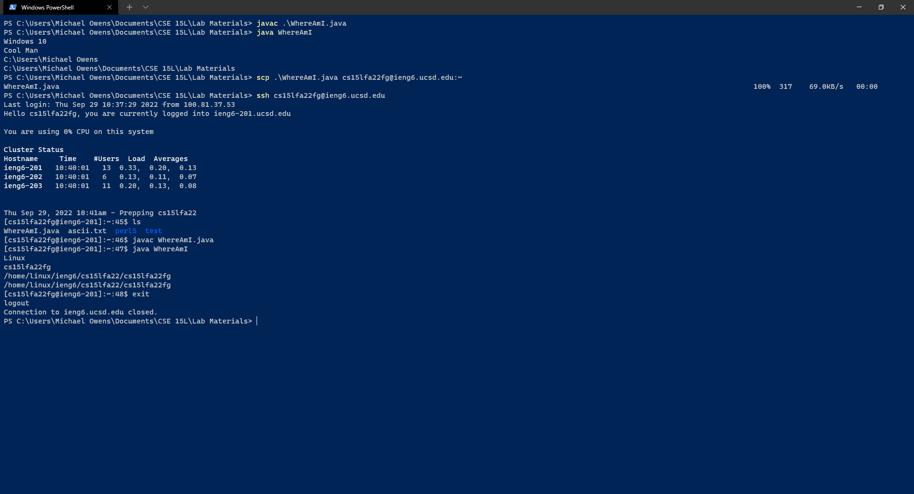
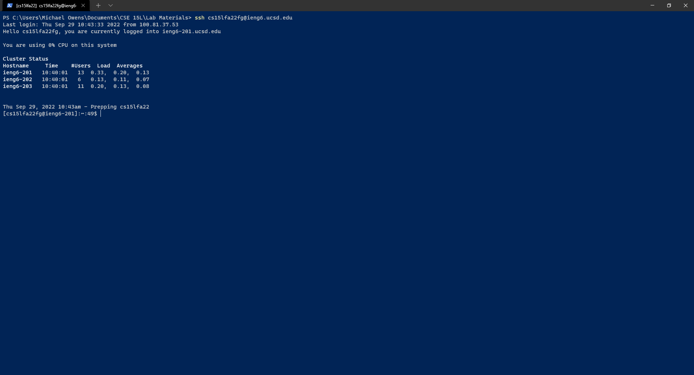

# Week 1 Lab Report

1. [Installing VScode](#installing-vscode)
2. [Remotely Connecting](#remotely-connecting)
3. [Trying Some Commands](#trying-some-commands))
4. [Moving Files with scp](#moving-files-with-scp)
5. [Setting an SSH Key](#trying-some-commands)
6. [Optimizing Remote Running](#optimizing-remote-running)

### Installing VScode



I already had VSCode installed, which was nice, but for this lab I also a created a file that I would use later with `scp`. I have a lot of add-ons configured with VSCode, but I might get around to installing [VSCodium](https://vscodium.com/) which has open-source binaries for VSCode with Microsoft telemetry removed.

### Remotely Connecting



To remotely connect you use `ssh`, putting in your username as well as the hostname of the server you want to connect to. Before I set up this lab, I set up my password and SSH key so I wouldn't have to worry about logging in. This ended up working really well for me because none of my classmates could set up their passwords during the lab time.

### Trying Some Commands



When I saw prof. Politz run the WhereAmI.java command I was confused because the OS name only said Linux. I thought maybe the ieng6 servers used a custom distro that didn't change that property for the JVM. Apparently that's how `getProperty("os.name")` works though, because inspecting `/proc/version` these servers are running a **SUPER** old version of CentOS, yet `getProperty` just says "Linux".

### Moving Files with scp



We now get around to trying out `WhereAmI.java`. I'm also glad I had my SSH keys setup earlier because this would've been tedious otherwise. For this I just write WhereAmI.java in VSCode, copy it with `scp`, `ssh` into the server, and run it.

### Setting an SSH Key



For this step start by using ssh-keygen, and then copy the public key to the remote server in `.ssh`, naming it `authorized_keys`. This was all fine, just remember when you're setting up the `.ssh` directory to use `ls -a` to list hidden files/directories because you'll be confused about where `.ssh` went.

### Optimizing Remote Running

Finally, if we want to edit `WhereAmI.java` and run it fast, we can do our scp and commands as a one-liner using semicolons. It looks like this:

```bash
scp .\WhereAmI.java cs15lfa22fg@ieng6.ucsd.edu:~; ssh cs15lfa22fg@ieng6.ucsd.edu "javac WhereAmI.java; java WhereAmI"
```
