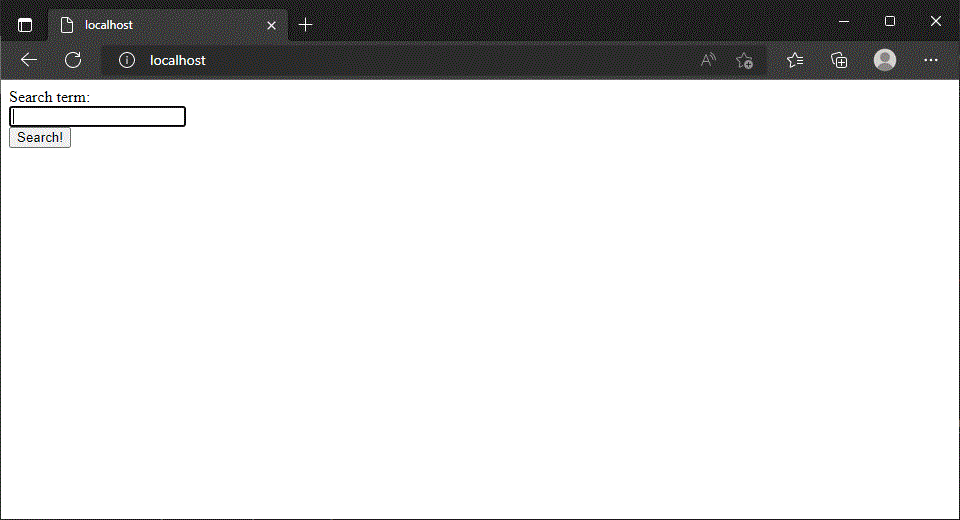
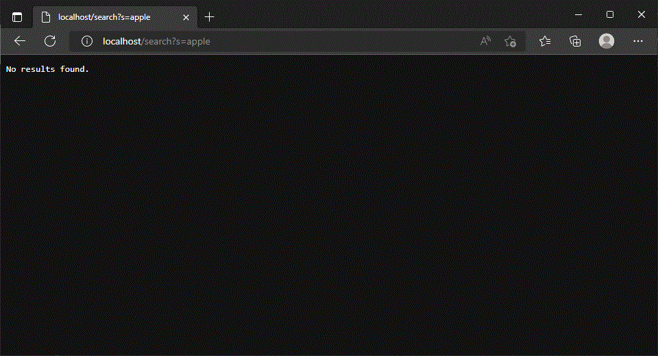
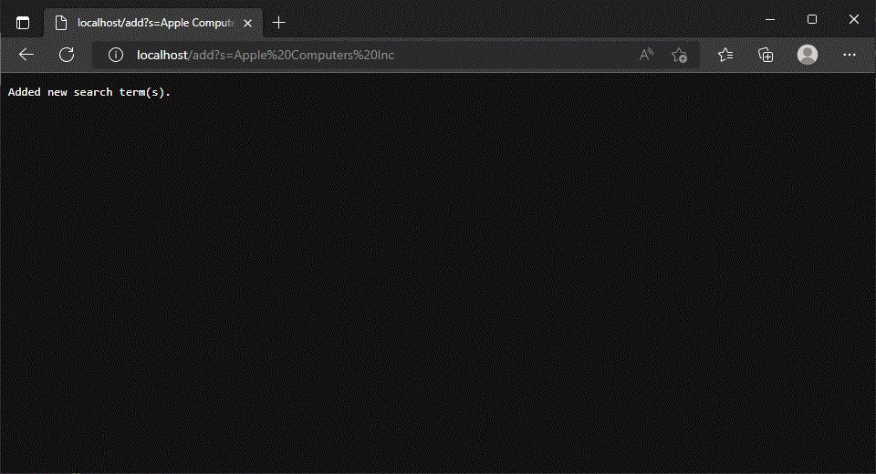
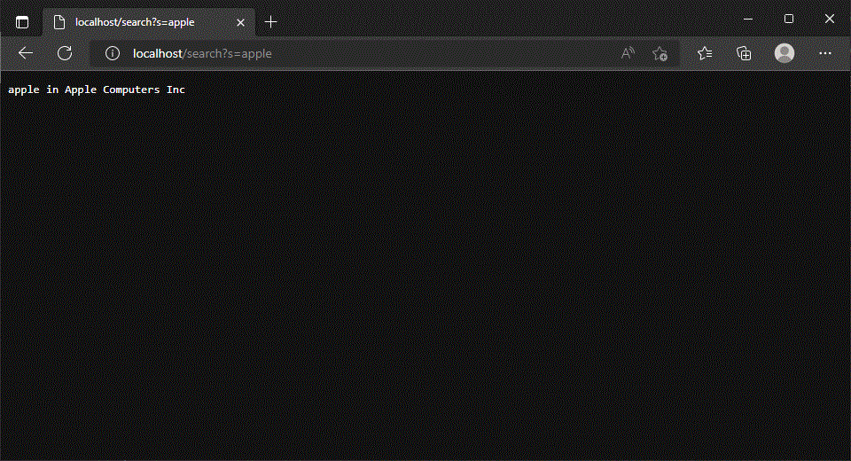

# Lab Report 3, Week 4

1. [Search Engine Code](#search-engine-code)
2. [Solving Bugs](#solving-bugs)

### Search Engine Code

```java
class SearchHandler implements URLHandler {
  ArrayList<String> searchterms = new ArrayList<>();
  final String MESSAGE404 = "404 not found";

  public String handleRequest(URI url) {
    HashMap<String, String> querysearchpairs = new HashMap<>();
    if (url.getPath().equals("/")) {
      return "<!DOCTYPE html>\n"
          + "<html>\n"
          + "<body>\n"
          + "<form action=\"/search\">\n"
          + "  <label for=\"s\">Search term:</label><br>\n"
          + "  <input type=\"text\" id=\"s\" name=\"s\" value=\"\"><br>\n"
          + "  <input type=\"submit\" value=\"Search!\">\n"
          + "</form>\n"
          + "\n"
          + "</body>\n"
          + "</html>";
    } else if (url.getQuery() == null) {
      return MESSAGE404;
    }
    try {
      String[] query = url.getQuery().split("[&]");
      for (String kvpair : query) {
        String[] pair = kvpair.split("=");
        String key = URLDecoder.decode(pair[0], StandardCharsets.UTF_8.name());
        String value = URLDecoder.decode(pair[1], StandardCharsets.UTF_8.name());
        if (key.equalsIgnoreCase("s")) {
          querysearchpairs.put(key, value);
        }
      }
    } catch (UnsupportedEncodingException e) {
      throw new Error("System does not support UTF-8 URL decoding");
    }
    if (url.getPath().equals("/add")) {
      for (Map.Entry<String, String> kvpair : querysearchpairs.entrySet()) {
        if (kvpair.getKey().equalsIgnoreCase("s")) {
          searchterms.add(kvpair.getValue());
          System.out.println("Added search term: " + kvpair.getValue());
        }
      }
      return "Added new search term(s).";
    } else if (url.getPath().equals("/search")) {
      StringBuilder response = new StringBuilder();
      for (Map.Entry<String, String> kvpair : querysearchpairs.entrySet()) {
        if (kvpair.getKey().equalsIgnoreCase("s")) {
          for (String s : searchterms) {
            if (containsCaseInsensitive(s, kvpair.getValue())) {
              response.append(kvpair.getValue());
              response.append(" in ");
              response.append(s);
              response.append('\n');
              System.out.println("Found search term: " + kvpair.getValue());
            }
          }
        }
      }
      if (response.toString().isEmpty()) {
        return "No results found.";
      }
      return response.toString();
    }
    return MESSAGE404;
  }

  boolean containsCaseInsensitive(String a, String b) {
    return Pattern.compile(Pattern.quote(b), Pattern.CASE_INSENSITIVE).matcher(a).find();
  }
}

class SearchServer {
  public static void main(String[] args) throws IOException {
    SearchHandler handler = new SearchHandler();
    switch (args.length) {
      case 0:
        System.out.println("Missing port number! Try any number between 1024 to 49151");
        return;
      case 1:
        System.out.println("Did not find directory to search. Running normally.");
        break;
      case 2:
        String dir = args[1];
        File toSearch = new File(dir);
        if (!toSearch.exists()) {
          System.out.println("No such directory: " + dir);
        }
        System.out.println("Found directory to add to search terms: " + dir);
        handler.searchterms.addAll(
            getFiles(toSearch).stream().map((File f) -> f.getPath()).collect(Collectors.toList()));
        break;
      default:
        System.out.println("Too many arguments: " + args);
        return;
    }
    int port = Integer.parseInt(args[0].trim());
    Server.start(port, handler);
  }

  public static List<File> getFiles(File start) throws IOException {
    List<File> result = new ArrayList<>();
    if (start.isFile()) {
      result.add(start);
    } else {
      File[] paths = start.listFiles();
      for (File subFile : paths) {
        result.addAll(getFiles(subFile));
      }
    }
    return result;
  }
}
```

<video width="80%" controls>
  <source src="./Lab-3-media/demovideo.mp4" type="video/mp4">
</video>

<details>
  <summary>See Screenshots</summary>
  
  
  
  
  
</details>

Here we have a demo video.

First we open the webpage on localhost:80. This makes a call to `handleRequest`. This call it follows the branch when the path is `"/"`, so it serves a small search page.

Next we search a term `"apple"`. There are no added search terms yet, so no results are found. This is also handled in handleRequest, in the `/search` branch. There are no search terms yet, so we do not call `containsCaseInsensitive`

We then add a search term `Apple Computers Inc`. Note that we can use spaces and capital letters. This add call goes down the `/add` branch in `handleRequest`. This ends up updating the `ArrayList` of `searchterms`.

Finally, we search again. Because we use a regex in containsCaseInsensitive, we can easily create a function that checks if one string contains another string in a case-insensitive fashion. This search calls `handleRequest` and `containsCaseInsensitive`. It searches through `searchterms` using a loop and `containsCaseInsensitive`.

### Solving Bugs

> `averageWithoutLowest`

**Failure inducing input:**

{1d, 1d, 2d}

**Symptom:**

The result was 1.0, not 2.0

```
java.lang.AssertionError:
Expected :2.0
Actual   :1.0
```

**Bug:**

The method does not account for the fact that there may be multiple instances of the lowest number in the array. In the instance that there are multiple instances of this number, it just assumes there is only 1 instance when computing the size of the modified array(used in the the final average calculation)

**Fixed code:**

```java
static double averageWithoutLowest(double[] arr) {
  if (arr.length < 2) {
    return 0.0;
  }
  double lowest = arr[0];
  for (double num : arr) {
    if (num < lowest) {
      lowest = num;
    }
  }
  //Added counting for lowest number
  int lowestcount = 0;
  for (double num : arr) {
    if (num == lowest) {
      lowestcount += 1;
    }
  }
  double sum = 0;
  for (double num : arr) {
    if (num != lowest) {
      sum += num;
    }
  }
  // Bugged original: return sum / (arr.length - 1);
  return sum / (arr.length - lowestcount);
}

@Test
public void testAverageWithoutLowest() {
  double[] input4 = {1d, 1d, 2d};
  assertEquals(2d, ArrayExamples.averageWithoutLowest(input4), 0.00001d);
}
```

> `getFiles`

**Failure inducing input:**

new File("testdir")

Where testdir is

- testdir
  - a.txt
  - b
    - c.txt
    - d
      - e.txt
      - f.txt

**Symptom:**

The method prints out folder names and doesn’t list all the files

```
java.lang.AssertionError:
Expected :[testdir\a.txt, testdir\b\c.txt, testdir\b\d\e.txt, testdir\b\d\f.txt]
Actual   :[testdir, testdir\a.txt, testdir\b]
```

**Bug:**

The method should recur on itself to capture all possible directories, and perform checks to determine whether an added File object is really a folder or file.

**Fixed Code:**

```java
static List<File> getFiles(File start) throws IOException {
  List<File> result = new ArrayList<>();
  if (start.isFile()) {
    result.add(start);
  } else {
    File[] paths = start.listFiles();
    for (File subFile : paths) {
      result.addAll(getFiles(subFile));
    }
  }
  return result;
}

@Test
public void testGetFiles() throws IOException {
  Assert.assertEquals(
      List.of(new File("testdir/a.txt")), FileExample.getFiles(new File("testdir/a.txt")));
  List<File> expected2 =
      List.of(
          new File("testdir/a.txt"),
          new File("testdir/b/c.txt"),
          new File("testdir/b/d/e.txt"),
          new File("testdir/b/d/f.txt"));
  Assert.assertEquals(expected2, FileExample.getFiles(new File("testdir")));
}
```
