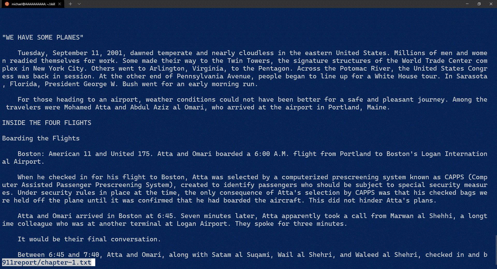
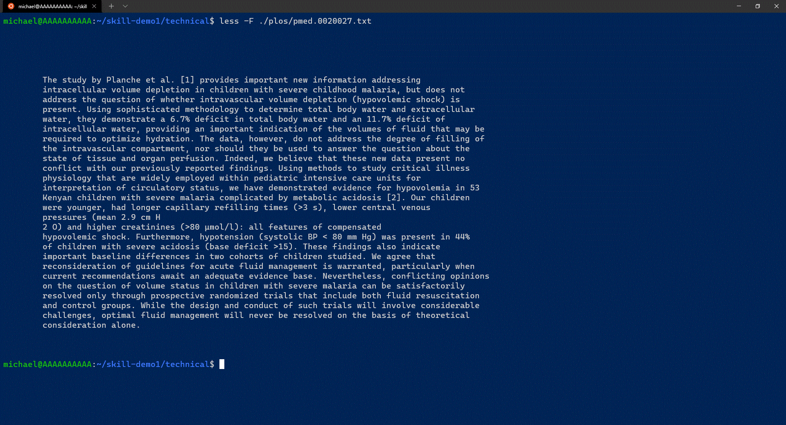
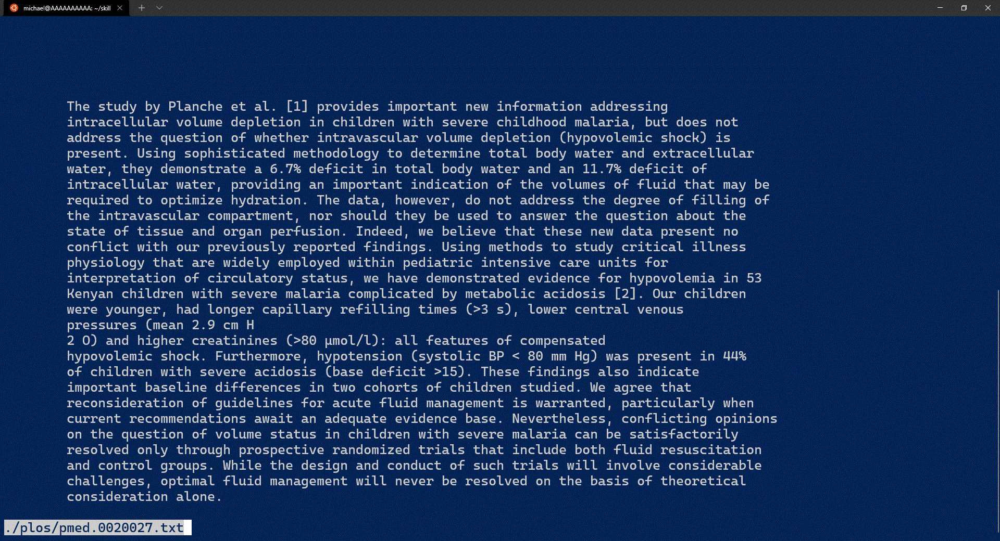
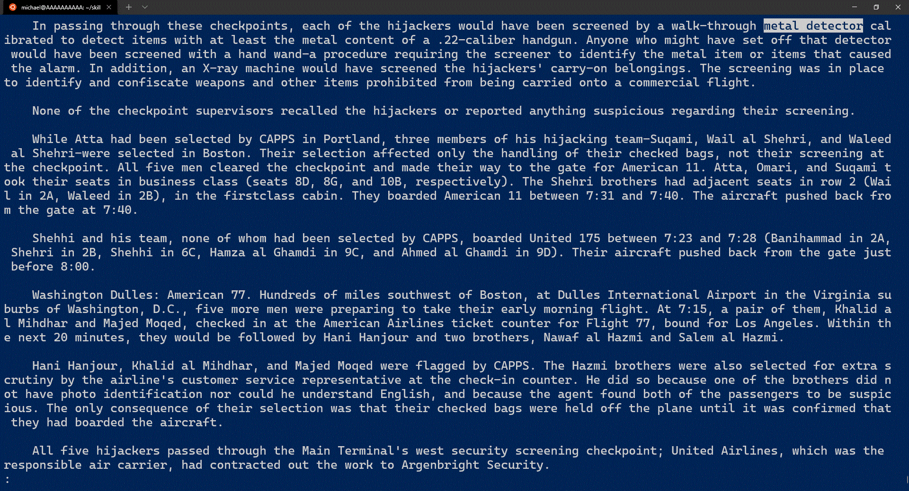
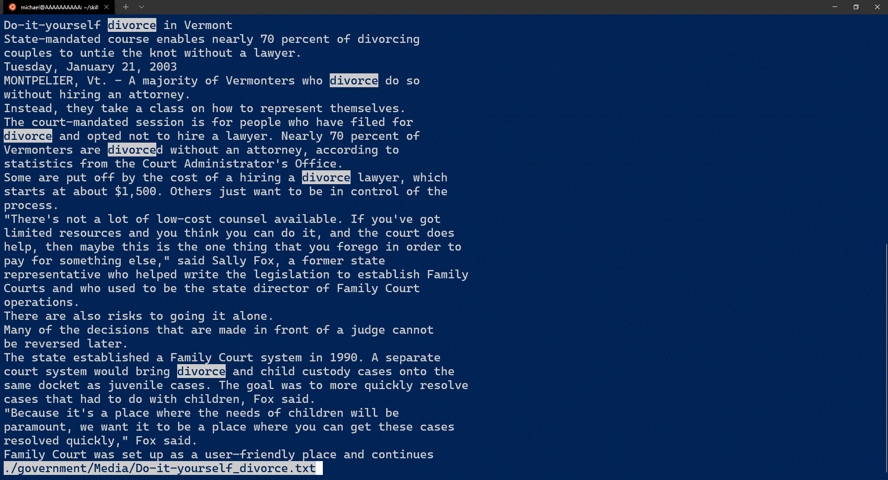
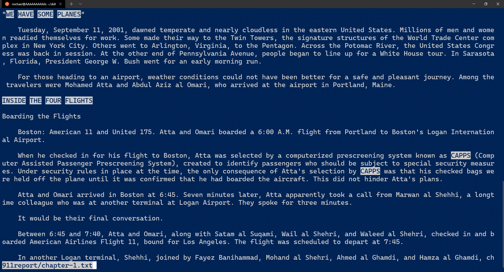
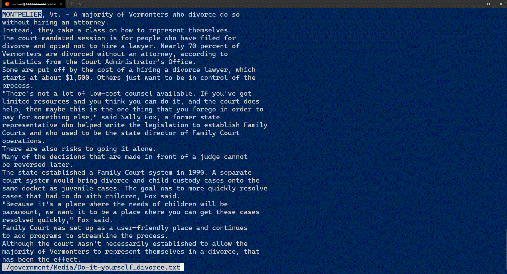
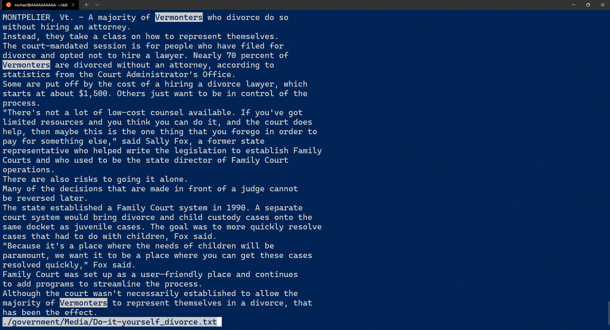
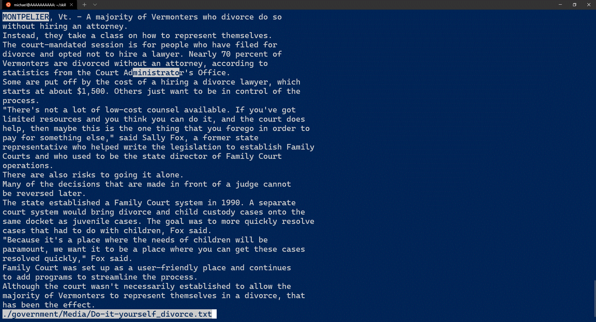

# Lab Report 4, Week 5: The `less` Command

_Note to TA/Tutor reading this: I couldn't put the output in a code block because less is fullscreen and you can't copy highlights from searches._

**_Edit for resubmit: clarified why the options are useful_**

1. [Quit If One Screen](#quit-if-one-screen)
2. [Patterns](#patterns)
3. [Case Insensitive Patterns](#case-insensitive-patterns)

## Quit If One Screen

This section details the behavior of the `-F` or `--quit-if-one-screen` flag.

This flag is useful when you have very short files. For instance, you may have a short shell script that you want to glance at, maybe to verify its contents, but taking over the whole screen and having to exit once done is annoying. This flag will allow the entire contents of (short) files to be printed quickly.

**Example 1:**

```bash
less -F 911report/chapter-1.txt
```



If the file is longer than one screen length (chapter 1 is quite a long file) then the flag doesn't change anything.

**Example 2:**

_(When zoomed out)_

```bash
less -F ./plos/pmed.0020027.txt
```



However, if the file is shorter than one screen length, less just prints the contents to the console.

**Example 3:**

_(When zoomed in)_

```bash
less -F ./plos/pmed.0020027.txt
```



Note that the command has different behavior depending on the zoom level in your terminal, as this affects how tall the terminal screen is. These changes happen even if the command is the same.

## Patterns

This section details the behavior of the `-p` or `--pattern` flag.

This flag is useful as it lets you jump to the first instance of a a pattern match. The `-p` has common behavior across many unix utilities so you can use existing patterns you've written with this option, and it's simpler than the builtin less command palette.

**Example 1:**

```bash
less -p "metal detector" 911report/chapter-1.txt
```



The pattern flag allows you to specify a pattern that will match to the text. It will jump to the first occurrence.

**Example 2:**

```bash
less -p "divorce" ./government/Media/Do-it-yourself_divorce.txt
```



The pattern flag highlights not just the first, but all occurrences of the pattern in the text. You can jump to next occurrence by pressing `n`.

**Example 3:**

```bash
less -p "[A-Z]{2,}" 911report/chapter-1.txt
```



You can get more fancy with the patterns, it utilizes the same pattern language as `grep`. Here I specify 2 or more consecutive occurrences of capital letters, which matches the titles in this chapter (as well as some acronyms).

## Case Insensitive Patterns

This section details the behavior of the `-i`/`-I` flags, a.k.a. `--ignore-case`/`--IGNORE-CASE` flags, respectively.

This flag is useful because when you're searching case isn't a big deal in many cases and only serves to complicate your pattern writing.

ex. `-Ip "hello!"` vs `-p "[Hh][Ee][Ll]{2}[Oo]!"`

In this example you have to account for both capitalizations of each character.

**Example 1:**

```bash
less -ip "montpelier" ./government/Media/Do-it-yourself_divorce.txt
```



The ignore case flag makes patterns ignore case. If it is lowercase(`-i`), it means all lowercase letters can match to uppercase letters, but not the other way around.

**Example 2:**

```bash
less -Ip "VERMONTERS" ./government/Media/Do-it-yourself_divorce.txt
```



Capitalizing the flag makes the behavior make a bit more sense. `-I` makes all letters in the pattern match either case, even if they're capitalized in the pattern.

**Example 3:**

```bash
less -Ip "m[A-Z]{9}" ./government/Media/Do-it-yourself_divorce.txt
```



Finally, we can once again get fancy with the patterns. Note how the pattern explicitly matches the class of characters, uppercase A-Z by using the square brackets. However, the `-I` flag broadens this to all letters. In the end, the pattern matches any substring that starts with an m and is followed by 9 letters, case insensitive.
