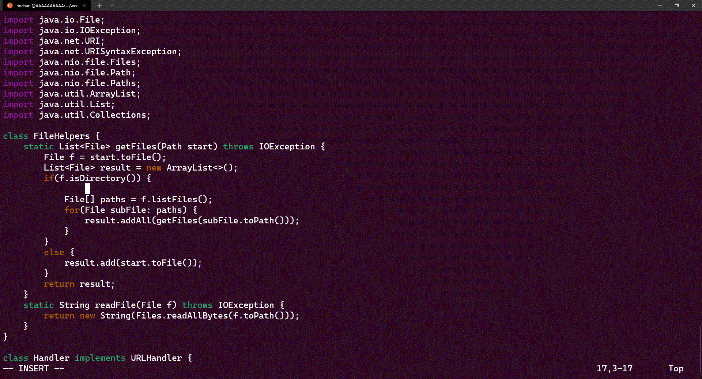

# Lab Report 5, Week 7

1. [Part 1: Vim-fu](#part-1-vim-fu)
2. [Part 2: Remote Editing Workflows](#part-2-remote-editing-workflows)

## Part 1: Vim-fu

My lab partner and I chose the following task:

> In DocSearchServer.java, add a new line right before File[] paths = f.listFiles(); that prints out the toString of f and a message saying it’s a directory.

This is what we came up with:

```vim
/isDir<Enter>oSystem.out.println(f.toString() + " is a directory");<Esc>:wq
```

Here's how it works:

First we want to quickly jump to the top of the if statement block that runs if a file is a directory, so we type `/isDir<Enter>` to search and jump to the first occurrence.


Then we want to create a new line below this if statement, so we can hit `o` (lowercase) to create a new line below and enter insert mode.



Then we just need to type our code, `System.out.println(f.toString() + " is a directory");`


Finally, we can re-enter normal mode and use `:wq` which calls the write out (`w`) and quit (`q`) commands in sequence, to save our file and exit.


## Part 2: Remote Editing Workflows

> Consider performing the edit task you chose and re-running the program when you have to run it remotely.

### Times:

- Once, start in Visual Studio Code and make the edit there, then scp the file to the remote server and run it there to confirm it works
  - Time: 23s
  - Issues
    - I don't know the commands to switch quickly between the editor and terminal in vscode
- Second, start already logged into a ssh session. Then, make the edit for the task you chose in Vim, then exit Vim and run bash test.sh.
  - Time: 19s
  - Issues
    - Had to figure out how to paste from my clipboard when using SSH + Vim

> Which of these two styles would you prefer using if you had to work on a program that you were running remotely, and why?

I would prefer to use the vscode workflow because I want to make my changes locally using the tools I already have installed on my computer. For instance, I can't use pycharm through a terminal(though there is probably some way to do it over SSH/HTTP). In general, I am more comfortable with my local environment. Furthermore, latency and dropped connections can be an issue.

> What about the project or task might factor into your decision one way or another? (If nothing would affect your decision, say so and why!)

If the machines are wiped frequently(as is common in cloud computing) then editing on the remote could have disastrous consequences. But if the remote had a special piece of software on it that my local machine could not run, it might be advantageous to use vim.
