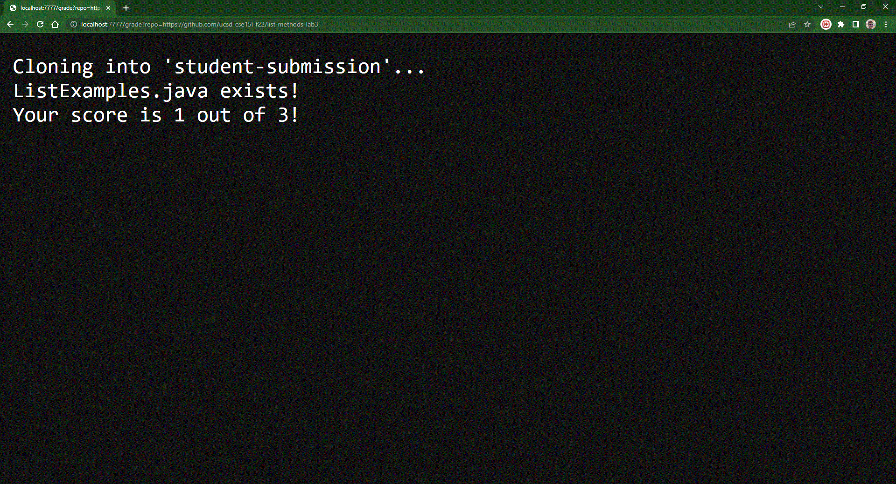

# Lab Report 6, Week 9

1. [Part 1: grade.sh](#part-1-gradesh)
2. [Part 2: Example Grading Screenshots](#example-grading-screenshots)
3. [Part 3: Tracing grade.sh](#part-3-tracing-gradesh)

## Part 1: grade.sh

This is our grade.sh ([Modified from my lab partner's repo to work on linux](https://github.com/lambchop96/list-examples-grader))

```bash
set -e

rm -rf student-submission
git clone $1 student-submission
cd student-submission/
FILE=ListExamples.java

if [[ -f "$FILE" ]]
then
        echo "ListExamples.java exists!"
else
        echo "Cannot find ListExamples.java!"
        echo "Your score is 0 out of 3!"
        exit
fi

cp ../TestListExamples.java ./

set +e

SCORE=0

javac -cp ".:../lib/*" ListExamples.java TestListExamples.java

if [[ $? -eq 0 ]]
then
  SCORE=$(($SCORE+1))
else
  echo "Your score is" $SCORE "out of 3!"
  exit
fi

FAILED=$(java -cp ".:../lib/*" org.junit.runner.JUnitCore TestListExamples | grep -oP "(?<=,  Failures: )[0-9]+")

if [[ $? -eq 1 ]] # passed all tests
then
  SCORE=$(($SCORE+2))
else
  SCORE=$(($SCORE+2-$FAILED))
fi

echo "Your score is" $SCORE "out of 3!"
```

## Part 2: Example Grading Screenshots


In this example all the method are correct and the student receives 3/3 points



In this example both of the methods fail and the student receives 1/3 points, 1 for compiling successfully


In this example a compile error is thrown and the student gets 0/3 points. We allow the compiler output so that the code can be fixed or issues with the java toolchain can be exposed.

## Part 3: Tracing grade.sh

I will choose the corrected methods, which receive 3/3 points as it is the most interesting.

_Sorry for bad formatting, it's exported from Google Sheets_

<table class="waffle" cellspacing="0" cellpadding="0"><thead><tr><th class="row-header freezebar-origin-ltr"></th><th id="0C0" style="width:41px;" class="column-headers-background">A</th><th id="0C1" style="width:156px;" class="column-headers-background">B</th><th id="0C2" style="width:212px;" class="column-headers-background">C</th><th id="0C3" style="width:64px;" class="column-headers-background">D</th><th id="0C4" style="width:231px;" class="column-headers-background">E</th></tr></thead><tbody><tr style="height: 20px"><th id="0R0" style="height: 20px;" class="row-headers-background"><div class="row-header-wrapper" style="line-height: 20px">1</div></th><td class="s0" dir="ltr">Line</td><td class="s0" dir="ltr">stdout</td><td class="s0" dir="ltr">stderr</td><td class="s0" dir="ltr">exit code</td><td class="s0" dir="ltr">comments</td></tr><tr style="height: 20px"><th id="0R1" style="height: 20px;" class="row-headers-background"><div class="row-header-wrapper" style="line-height: 20px">2</div></th><td class="s1" dir="ltr">1</td><td></td><td></td><td class="s0" dir="ltr">zero</td><td></td></tr><tr style="height: 20px"><th id="0R2" style="height: 20px;" class="row-headers-background"><div class="row-header-wrapper" style="line-height: 20px">3</div></th><td class="s1" dir="ltr">3</td><td></td><td></td><td class="s0" dir="ltr">zero</td><td></td></tr><tr style="height: 20px"><th id="0R3" style="height: 20px;" class="row-headers-background"><div class="row-header-wrapper" style="line-height: 20px">4</div></th><td class="s1" dir="ltr">4</td><td></td><td class="s0" dir="ltr">Cloning into 'student-submission'...</td><td class="s0" dir="ltr">zero</td><td></td></tr><tr style="height: 20px"><th id="0R4" style="height: 20px;" class="row-headers-background"><div class="row-header-wrapper" style="line-height: 20px">5</div></th><td class="s1" dir="ltr">5</td><td></td><td></td><td class="s0" dir="ltr">zero</td><td></td></tr><tr style="height: 20px"><th id="0R5" style="height: 20px;" class="row-headers-background"><div class="row-header-wrapper" style="line-height: 20px">6</div></th><td class="s1" dir="ltr">6</td><td></td><td></td><td class="s0" dir="ltr">zero</td><td class="s0" dir="ltr">sets up a filename variable we<br>forgot to use</td></tr><tr style="height: 20px"><th id="0R6" style="height: 20px;" class="row-headers-background"><div class="row-header-wrapper" style="line-height: 20px">7</div></th><td class="s1" dir="ltr">8</td><td></td><td></td><td class="s0" dir="ltr">ig</td><td class="s0" dir="ltr">Checks if file exists/directory<br>structure is correct</td></tr><tr style="height: 20px"><th id="0R7" style="height: 20px;" class="row-headers-background"><div class="row-header-wrapper" style="line-height: 20px">8</div></th><td class="s1" dir="ltr">10</td><td class="s0" dir="ltr">ListExamples.java exists!</td><td></td><td class="s0" dir="ltr">zero</td><td class="s0" dir="ltr">Lets the user know the file can be<br>found to be tested</td></tr><tr style="height: 20px"><th id="0R8" style="height: 20px;" class="row-headers-background"><div class="row-header-wrapper" style="line-height: 20px">9</div></th><td class="s1" dir="ltr">12-14</td><td></td><td></td><td class="s0" dir="ltr">Didn't run</td><td class="s0" dir="ltr">If the file cannot be found, the<br>submission myst be fixed and the<br>student gets 0/3</td></tr><tr style="height: 20px"><th id="0R9" style="height: 20px;" class="row-headers-background"><div class="row-header-wrapper" style="line-height: 20px">10</div></th><td class="s1" dir="ltr">17</td><td></td><td></td><td class="s0" dir="ltr">zero</td><td></td></tr><tr style="height: 20px"><th id="0R10" style="height: 20px;" class="row-headers-background"><div class="row-header-wrapper" style="line-height: 20px">11</div></th><td class="s1" dir="ltr">19</td><td></td><td></td><td class="s0" dir="ltr">zero</td><td></td></tr><tr style="height: 20px"><th id="0R11" style="height: 20px;" class="row-headers-background"><div class="row-header-wrapper" style="line-height: 20px">12</div></th><td class="s1" dir="ltr">21</td><td></td><td></td><td class="s0" dir="ltr">zero</td><td class="s0" dir="ltr">Sets up a score counter</td></tr><tr style="height: 20px"><th id="0R12" style="height: 20px;" class="row-headers-background"><div class="row-header-wrapper" style="line-height: 20px">13</div></th><td class="s1" dir="ltr">23</td><td></td><td></td><td class="s0" dir="ltr">zero</td><td></td></tr><tr style="height: 20px"><th id="0R13" style="height: 20px;" class="row-headers-background"><div class="row-header-wrapper" style="line-height: 20px">14</div></th><td class="s1" dir="ltr">25</td><td></td><td></td><td class="s0" dir="ltr">if</td><td class="s0" dir="ltr">If the compile succeeds, increment<br>the score by one. The score is now 1.</td></tr><tr style="height: 20px"><th id="0R14" style="height: 20px;" class="row-headers-background"><div class="row-header-wrapper" style="line-height: 20px">15</div></th><td class="s1" dir="ltr">27</td><td></td><td></td><td class="s0" dir="ltr">zero</td><td class="s0" dir="ltr">Add one point for compiling</td></tr><tr style="height: 20px"><th id="0R15" style="height: 20px;" class="row-headers-background"><div class="row-header-wrapper" style="line-height: 20px">16</div></th><td class="s1" dir="ltr">29-30</td><td></td><td></td><td class="s0" dir="ltr">Didn't run</td><td class="s0" dir="ltr">If the compile fails, exit with 0/3 points</td></tr><tr style="height: 20px"><th id="0R16" style="height: 20px;" class="row-headers-background"><div class="row-header-wrapper" style="line-height: 20px">17</div></th><td class="s1" dir="ltr">33</td><td></td><td></td><td class="s0" dir="ltr">nonzero</td><td class="s0" dir="ltr"></td></tr><tr style="height: 20px"><th id="0R17" style="height: 20px;" class="row-headers-background"><div class="row-header-wrapper" style="line-height: 20px">18</div></th><td class="s1" dir="ltr">35</td><td></td><td></td><td class="s0" dir="ltr">if</td><td class="s0" dir="ltr">This is an if statement that checks<br>if the above grep doesn't match<br>anything. The grep is looking for<br>failures in the test output, so if it<br>matches nothing, it returns an exit<br>code of 1, meaning the tests<br>succeeded(no failures)</td></tr><tr style="height: 20px"><th id="0R18" style="height: 20px;" class="row-headers-background"><div class="row-header-wrapper" style="line-height: 20px">19</div></th><td class="s1" dir="ltr">37</td><td></td><td></td><td class="s0" dir="ltr">zero</td><td class="s0" dir="ltr">increments the score by two because<br>all tests passed. The score is now 3.</td></tr><tr style="height: 20px"><th id="0R19" style="height: 20px;" class="row-headers-background"><div class="row-header-wrapper" style="line-height: 20px">20</div></th><td class="s1" dir="ltr">39</td><td></td><td></td><td class="s0" dir="ltr">Didn't run</td><td class="s0" dir="ltr">The grep returns the number of<br>failures. This does the math for giving<br>points for each passing test</td></tr><tr style="height: 20px"><th id="0R20" style="height: 20px;" class="row-headers-background"><div class="row-header-wrapper" style="line-height: 20px">21</div></th><td class="s1" dir="ltr">42</td><td class="s0" dir="ltr">Your score is 3 out of 3!</td><td></td><td class="s0" dir="ltr">zero</td><td></td></tr></tbody></table>
